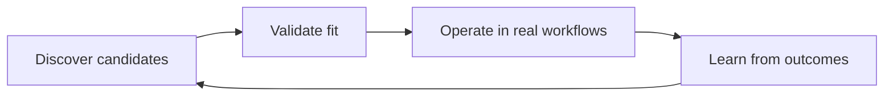
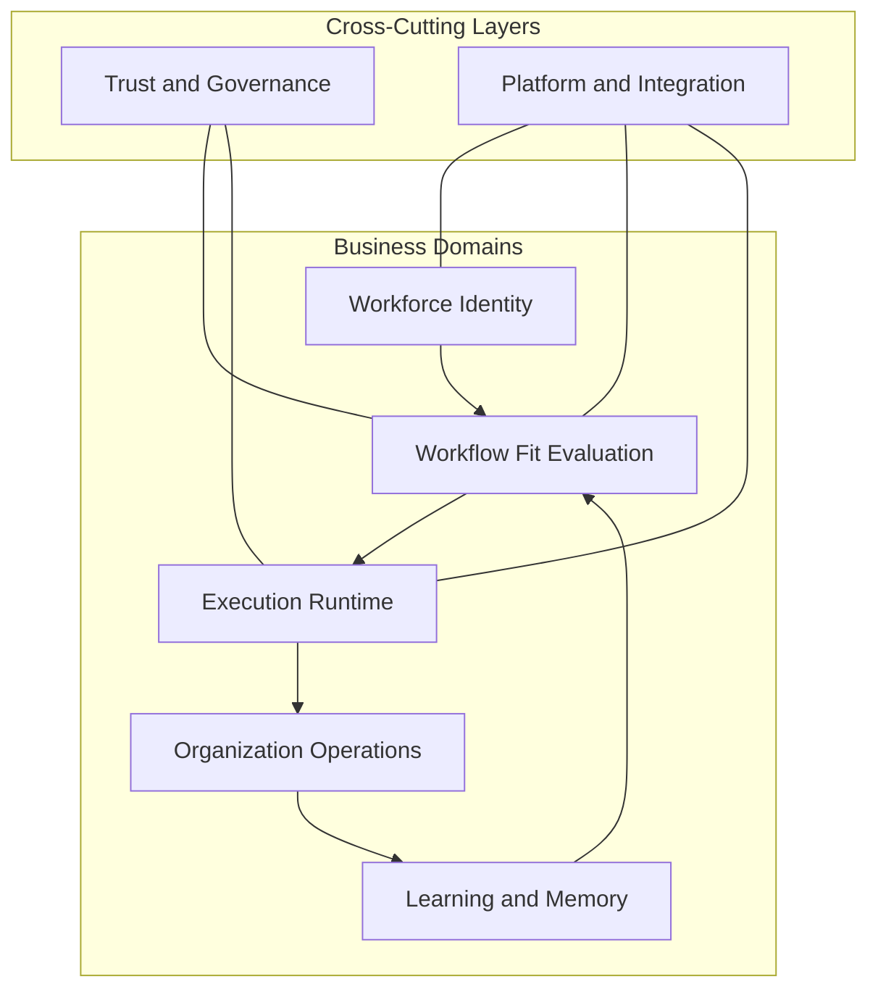
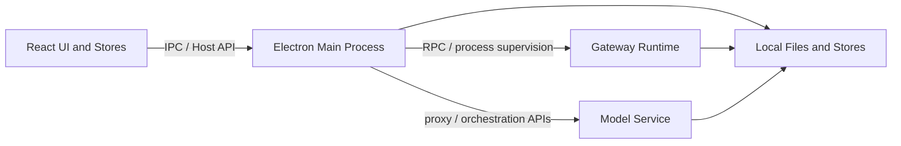

# AgentCorp Architecture Blueprint

> Public contributor guide for AgentCorp's product architecture, system boundaries, and near-term refactoring priorities.

## 1. North Star

AgentCorp is a **workflow-fit platform for discovering, validating, operating, and improving AI agents**.

It is not just a chat shell, a benchmark dashboard, or a template marketplace. The product loop is:



### Product stages

1. **Discover** — candidate discovery, import, matching, and shortlist generation.
2. **Validate** — structured interview, craft trials, evaluation scoring, and reliability checks.
3. **Operate** — task routing, team collaboration, runtime execution, and review.
4. **Learn** — work outcomes, preference feedback, performance summaries, and reusable experience.

## 2. Domain Map

AgentCorp is organized around five business domains plus two cross-cutting layers.



### 2.1 Workforce Identity

**Purpose**: define who agents are, how they are grouped, and how they are addressed.

**Key responsibilities**
- Agent profiles, personas, workspaces, roles, hierarchy
- Team membership and leader/member structure
- Session entry points and ownership bindings

**Primary code**
- `electron/utils/agent-config.ts`
- `electron/api/routes/agents.ts`
- `src/stores/agents.ts`
- `src/stores/teams.ts`

### 2.2 Workflow Fit Evaluation

**Purpose**: determine which agent is the best fit for a specific workflow and task context.

**Key responsibilities**
- Task profiling and candidate ranking
- Structured interviews and craft trials
- Stage scoring, KPI/ROI, leaderboards
- Reliability and evaluator health

**Primary code**
- `src/stores/marketplace.ts`
- `src/stores/interview.ts`
- `src/stores/evaluation.ts`
- `src/stores/scoringStore.ts`
- `src/engine/marketplace/*`
- `src/engine/interview/*`
- `src/engine/evaluation/*`
- `model-service/app/scoring/*`

### 2.3 Execution Runtime

**Purpose**: run real work through agents and teams.

**Key responsibilities**
- Task claiming and concurrency control
- Agent routing and team orchestration
- Runtime sessions, execution traces, delivery artifacts
- Fallback between direct LLM execution and gateway execution

**Primary code**
- `src/stores/autoWorker.ts`
- `src/engine/squad/*`
- `electron/services/session-runtime-manager.ts`
- `electron/utils/task-config.ts`
- `electron/api/routes/tasks.ts`

### 2.4 Organization Operations

**Purpose**: make agent work visible and manageable to operators.

**Key responsibilities**
- Office roster and department mapping
- Task board, review queue, execution timeline
- Team room updates and runtime visibility

**Primary code**
- `src/pages/Office/*`
- `src/pages/Office/TaskBoard.tsx`
- `src/engine/office/assignment.ts`
- `src/stores/approvals.ts`
- `src/stores/teams.ts`

### 2.5 Learning and Memory

**Purpose**: convert workflow outcomes into better future matching and execution.

**Key responsibilities**
- Work outcome feedback loops
- Preference learning from ranking/reordering
- Team performance summaries
- Experience cards, capsules, convergence traces

**Primary code**
- `src/services/workEvaluationLoop.ts`
- `src/stores/performance.ts`
- `src/stores/experience.ts`
- `src/stores/convergenceStore.ts`
- `src/services/preferenceStore.ts`
- `src/services/convergenceService.ts`

### 2.6 Trust and Governance

**Purpose**: keep decisions explainable, reviewable, and bounded by real evidence.

**Key responsibilities**
- Verified evidence vs. model-generated evidence
- Judge / mixed / degraded source disclosure
- Sandbox execution and security scanning
- Approval audit and lifecycle governance

**Primary code**
- `model-service/app/sandbox/*`
- `model-service/app/scoring/stage_scorer.py`
- `src/engine/evaluation/metaJudge.ts`
- `src/pages/Evaluation/Leaderboard.tsx`
- `src/pages/Evaluation/LifecyclePanel.tsx`

### 2.7 Platform and Integration

**Purpose**: provide the local platform surface, runtime integrations, and secure IO boundaries.

**Key responsibilities**
- Electron app lifecycle and preload bridge
- Host API and IPC transport
- Gateway process supervision
- Provider secrets, storage, updater, packaging

**Primary code**
- `electron/main/*`
- `electron/preload/index.ts`
- `electron/api/*`
- `electron/gateway/*`
- `electron/services/secrets/*`
- `src/lib/host-api.ts`
- `src/lib/api-client.ts`

## 3. Core Entities

Every new feature should map back to one or more of the following entities.

| Entity | Meaning | Primary source of truth |
|---|---|---|
| `Agent` | A configured digital worker with persona, workspace, session entrypoint, and role metadata | `electron/utils/agent-config.ts` |
| `Team` | A group of agents with a leader and members | Host API `/api/teams` |
| `Task` | A work item to be executed, reviewed, and archived | `electron/utils/task-config.ts` |
| `Run` | A concrete execution instance bound to session/runtime state | Gateway + `session-runtime-manager` |
| `EvaluationProfile` | Long-lived performance and fit profile for an agent | `src/services/evaluationStore.ts` |
| `StageScore` | Stage-specific scoring card (pre-screen / interview / performance) | Model service scoring + stage score store |
| `Trace` | Structured execution or delegation history | Task execution events + A2A traces |
| `PreferenceSignal` | A user feedback signal from ranking or drag-reordering | `src/services/preferenceStore.ts` |
| `Capsule` | Reusable post-task experience artifact | Host API `/api/capsules` |

## 4. System Topology



### Runtime boundary rules

- **UI layer** must not directly read local files or secrets.
- **Electron main** owns privileged IO, persistence, OS integrations, and request proxying.
- **Gateway** owns sessions and runtime execution state.
- **Model service** owns evaluation contracts, scoring logic, and verification helpers.

## 5. Single Source of Truth Rules

AgentCorp already contains several data stores. Contributors must preserve source-of-truth boundaries.

| Area | Source of truth | UI/store role |
|---|---|---|
| Agents | `agent-config` in main process | Cached projection |
| Teams | Host API `/api/teams` | Cached projection |
| Tasks | `tasks.json` via main process | Cached projection |
| Runtime sessions | Gateway + `session-runtime-manager` | Cached projection |
| Evaluation profiles | evaluation store | Cached projection |
| Preference history | preference store | Cached projection |
| Convergence traces | convergence service + cache | Cached projection |

**Rule**: avoid introducing new durable stores unless the entity model above cannot represent the feature.

## 6. Contributor Placement Guide

When adding or changing behavior, place code by responsibility.

### Put logic in `src/engine/*` when
- the logic is deterministic
- it can be expressed as a pure function
- it should be shared across pages or stores
- it benefits from unit testing independent of UI

Examples: matching, routing, scoring formulas, task classification.

### Put logic in `src/services/*` when
- the logic coordinates network, IPC, persistence, or runtime adapters
- the logic is a reusable use-case boundary
- it should not live inside a page component

Examples: evaluation runtime, convergence service, craft client, work evaluation loop.

### Put logic in `src/stores/*` when
- the main job is exposing state to UI
- the code composes multiple services for a single screen or workflow
- the output is immediately bound to rendering state

**Do not** turn stores into general-purpose dumping grounds for every new domain rule.

### Put logic in `electron/*` when
- it needs filesystem access
- it needs process management
- it needs secure token storage
- it needs privileged OS integration

## 7. Active Refactoring Priorities

The following priorities should guide incoming work.

### Priority A — Brand and surface consistency
- Keep external product language centered on **workflow fit, operation, and learning**.
- Avoid reviving outdated product routes, legacy brand strings, or placeholder features.
- Prefer neutral and professional operator language over theatrical or game-like labels.

### Priority B — Move orchestration out of giant stores
Current large stores (`interview`, `evaluation`, `autoWorker`, `chat`) contain both state and orchestration logic.

Target direction:
- keep stores as UI-facing state containers
- extract reusable workflow use-cases into services
- keep formulas and selection rules in engine modules

### Priority C — Strengthen event-driven projections
Task execution, A2A collaboration, evaluation, and preference learning already emit event-like records.

Target direction:
- prefer append-only domain events over overwrite-heavy state coupling
- let pages consume projections of shared execution/evaluation facts
- keep task timeline, team room, and evaluation feedback loops consistent

### Priority D — Preserve evidence discipline
- `verifiedEvidence` must remain separate from model-generated evidence
- degraded results must stay clearly disclosed
- reliability and evaluator-health signals must never be silently downgraded or hidden

## 8. Change Checklist for Contributors

Before opening a PR, verify:

1. **Domain fit** — which domain in Section 2 does this change belong to?
2. **Entity fit** — which core entity in Section 3 changes?
3. **Truth source** — are you writing to the correct source of truth?
4. **Placement** — should this be engine, service, store, or Electron/main-process code?
5. **Disclosure** — does the UI still truthfully expose degraded, partial, or verified states?
6. **Consistency** — do routes, labels, and docs match the product architecture?

## 9. Near-Term Target Architecture

The long-term direction is:

```text
UI Pages
  ↓
UI Stores (screen state)
  ↓
Use-Case Services (workflow orchestration)
  ↓
Domain Engines (pure logic)
  ↓
Adapters (Host API / Gateway / Model Service / Storage)
  ↓
Runtime & Persistence (Electron main, Gateway, local stores)
```

This blueprint is intentionally concise. It should remain stable while implementation details evolve.

## 10. Companion Documents

- [`docs/architecture-system-map.md`](./architecture-system-map.md) — runtime topology, entity map, state machines, and module migration targets
