# AgentCorp System Map

> Public working map for contributors who need to understand **how the product fits together**, **where data lives**, and **which modules should evolve next**.

This document complements [`docs/architecture-blueprint.md`](./architecture-blueprint.md):

- the **blueprint** defines product positioning, domain boundaries, and placement rules
- the **system map** explains runtime flow, entity relations, state machines, and refactor direction

---

## 1. Product Loop at a Glance

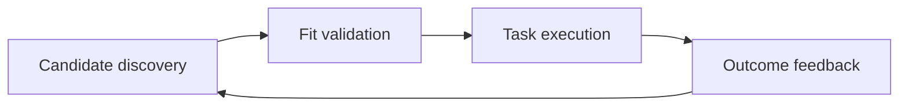

### What each stage means

| Stage | User-facing product area | Core question |
|---|---|---|
| Candidate discovery | Marketplace | Which agents should I even consider? |
| Fit validation | Interview + Evaluation | Which candidate is the best fit for this workflow? |
| Task execution | Office + Task Board + Runtime | How does the chosen agent actually do the work? |
| Outcome feedback | Evaluation loop + Experience + Preference | What did the system learn from real usage? |

---

## 2. Runtime Topology

AgentCorp is a multi-runtime desktop system.

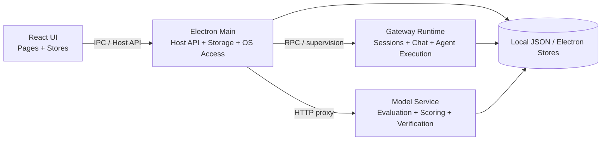

### Boundary rules

- **UI** renders projections and triggers workflows.
- **Electron main** owns file access, secure storage, app lifecycle, and routing to runtime services.
- **Gateway runtime** owns session execution and live conversation state.
- **Model service** owns evaluation contracts, scoring rules, judge outputs, and verification helpers.
- **Local stores** hold durable snapshots needed across app restarts.

---

## 3. Core Entity Map

Contributors should map all feature work to these core entities.

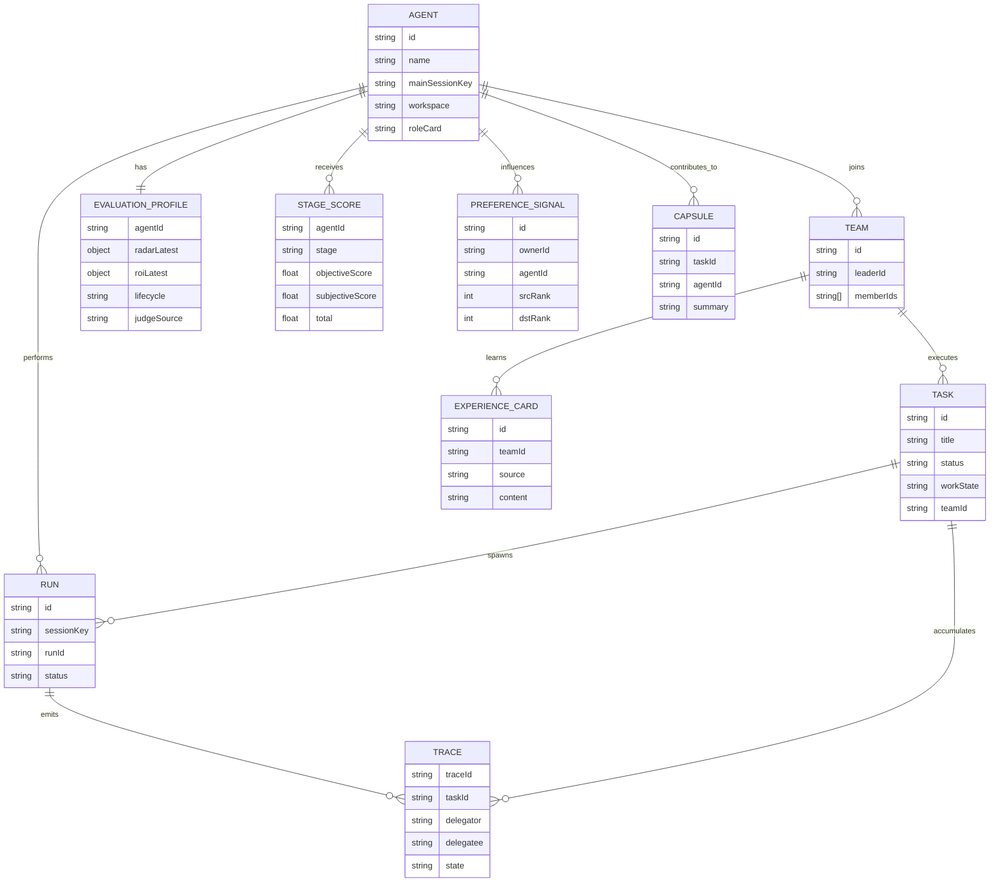

### Entity ownership

| Entity | Main source of truth | Typical projection |
|---|---|---|
| `Agent` | `electron/utils/agent-config.ts` | `src/stores/agents.ts` |
| `Team` | Host API `/api/teams` | `src/stores/teams.ts` |
| `Task` | `electron/utils/task-config.ts` | `src/stores/approvals.ts` |
| `Run` | Gateway + `session-runtime-manager` | chat/runtime panels |
| `EvaluationProfile` | evaluation store | evaluation page, office roster |
| `StageScore` | model-service scoring + stage score store | evaluation page, marketplace perf boost |
| `Trace` | task execution events + A2A trace persistence | task board, trace browser |
| `PreferenceSignal` | preference store | dual leaderboard, marketplace sort |
| `Capsule` | capsule API/store | evaluation evidence, future recall |
| `ExperienceCard` | team experience store | orchestration context injection |

---

## 4. Main Workflow Map

## 4.1 Discover → Validate

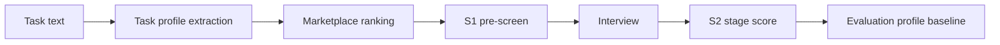

### Code path

| Step | Main modules |
|---|---|
| Task profile extraction | `src/engine/marketplace/taskMatch.ts` |
| Candidate ranking | `src/engine/marketplace/matchScore.ts`, `src/stores/marketplace.ts` |
| S1 pre-screen | `src/stores/marketplace.ts`, `src/stores/scoringStore.ts`, `model-service/app/routes/leaderboard.py` |
| Interview orchestration | `src/stores/interview.ts`, `src/engine/interview/questionBank.ts`, `src/services/interviewRunner.ts` |
| Craft trials | `src/services/craftClient.ts`, `model-service/app/scoring/craft_judge.py` |
| S2 stage scoring | `src/stores/scoringStore.ts`, `model-service/app/scoring/stage_scorer.py` |
| Baseline writeback | `src/stores/interview.ts`, `src/stores/evaluation.ts` |

## 4.2 Validate → Operate

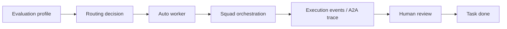

### Code path

| Step | Main modules |
|---|---|
| Routing | `src/engine/squad/squadRouting.ts` |
| Task claiming / execution loop | `src/stores/autoWorker.ts` |
| Team orchestration | `src/engine/squad/squadOrchestration.ts`, `src/services/team/team-execution.ts` |
| Runtime session tracking | `electron/services/session-runtime-manager.ts` |
| Task persistence | `electron/utils/task-config.ts`, `src/stores/approvals.ts` |
| Operator view | `src/pages/Office/TaskBoard.tsx`, `src/pages/Office/index.tsx`, `src/pages/Chat/TeamChatView.tsx` |

## 4.3 Operate → Learn

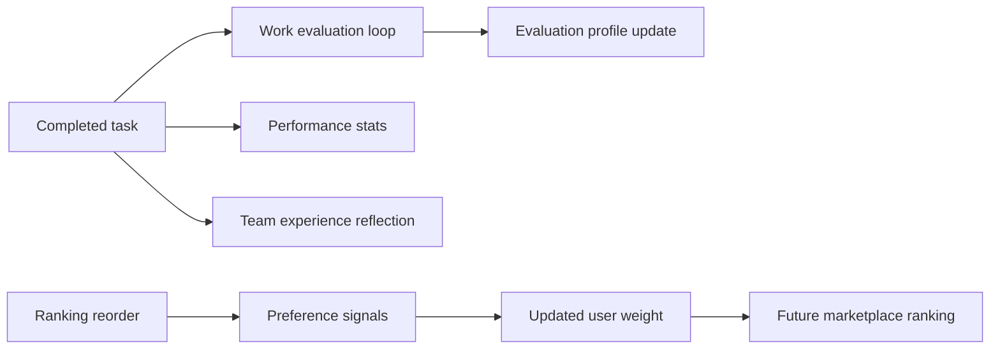

### Code path

| Step | Main modules |
|---|---|
| Work outcome → evaluation | `src/services/workEvaluationLoop.ts`, `src/stores/evaluation.ts` |
| Team delivery → room + experience loop | `src/services/team/team-execution.ts`, `src/stores/teamChatWorkOrder.ts`, `src/stores/autoWorker.ts` |
| Performance aggregation | `src/stores/performance.ts` |
| Team experience reflection | `src/stores/experience.ts` |
| Preference learning | `src/stores/scoringStore.ts`, `model-service/app/scoring/preference.py` |
| Future ranking impact | `src/stores/marketplace.ts`, `src/engine/marketplace/matchScore.ts` |

---

## 5. State Machines

## 5.1 Interview Session

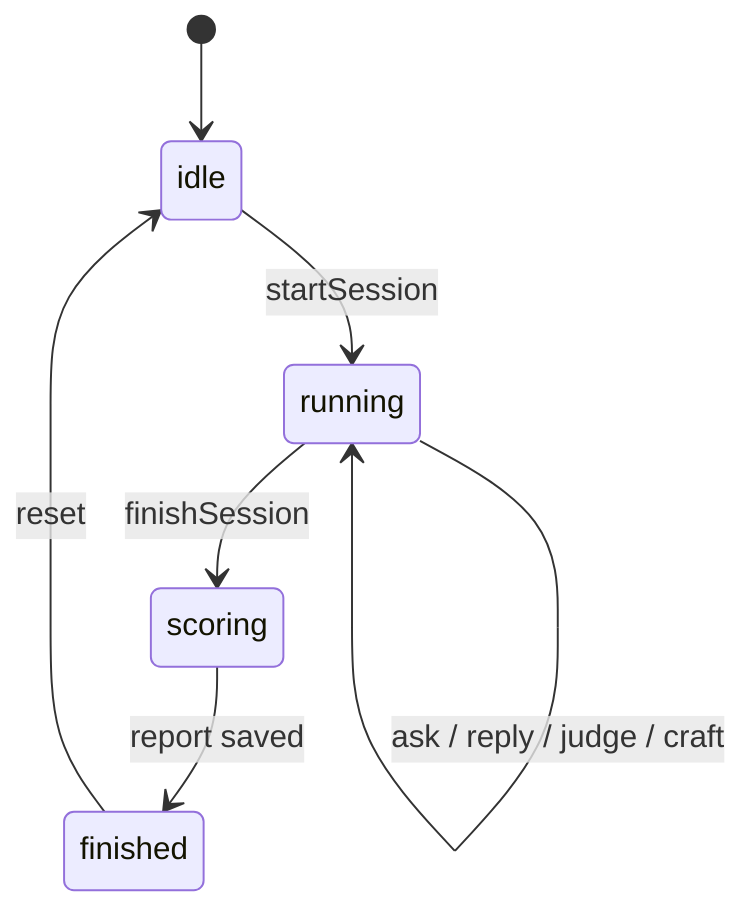

### Owned by
- `src/stores/interview.ts`

### Notes
- `running` is the active interview loop
- `scoring` is the report + stage-card assembly phase
- `finished` means the report exists, not necessarily that all downstream projections refreshed perfectly

## 5.2 Task Status vs Work State

AgentCorp task execution uses **two dimensions**:

- `status` = product workflow stage in the board
- `workState` = runtime execution condition

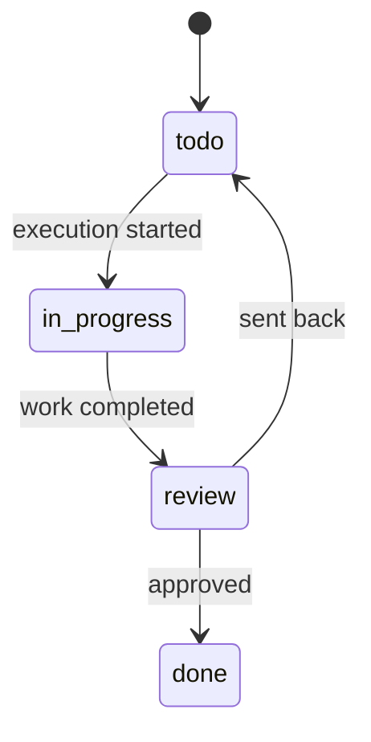

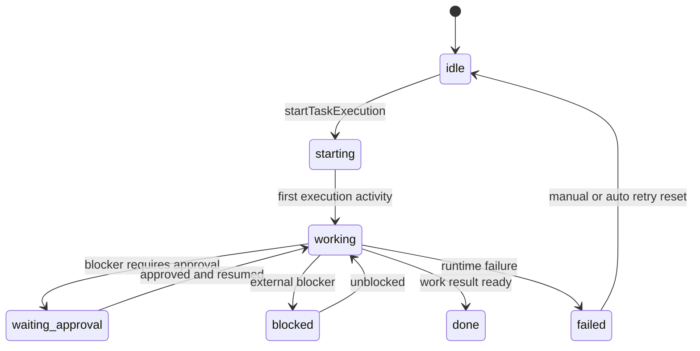

### Owned by
- persistent task state: `electron/utils/task-config.ts`
- UI projection: `src/stores/approvals.ts`
- execution loop: `src/stores/autoWorker.ts`

### Rule of thumb
- change `status` when board lane should move
- change `workState` when execution condition changes

## 5.3 Agent Lifecycle

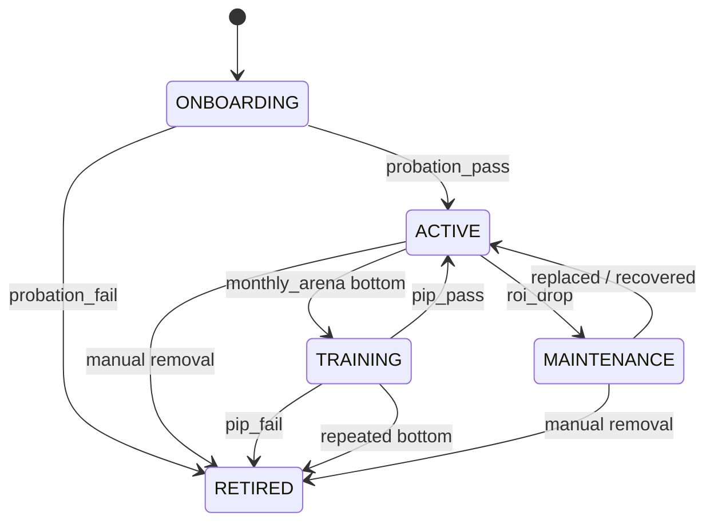

### Owned by
- lifecycle transition rules: `src/engine/strategyEngine.ts`
- profile persistence: `src/stores/evaluation.ts`
- governance UI: `src/pages/Evaluation/LifecyclePanel.tsx`

## 5.4 Judge Source Disclosure

This is not a user workflow state, but it is a critical truthfulness state.

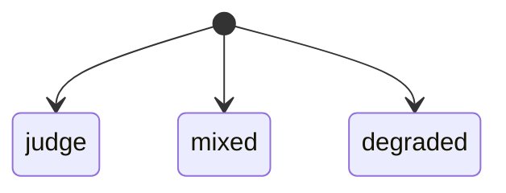

| State | Meaning |
|---|---|
| `judge` | result produced entirely by the intended evaluation path |
| `mixed` | result includes both real judge output and fallback behavior |
| `degraded` | result was produced without the intended judge path |

### Rule
Degraded results must remain visibly degraded in all ranking and governance surfaces.

---

## 6. Module Ownership Map

This is the shortest path to understanding where to work.

| Concern | Current primary module | Long-term direction |
|---|---|---|
| Task text → task profile | `src/engine/marketplace/taskMatch.ts` | keep as pure engine |
| Candidate ranking | `src/engine/marketplace/matchScore.ts` | keep as pure engine |
| Interview selection logic | `src/engine/interview/questionBank.ts` | keep as pure engine |
| Interview orchestration | `src/stores/interview.ts` | extract use-case services |
| Evaluation orchestration | `src/stores/evaluation.ts` | extract use-case services |
| Runtime execution loop | `src/stores/autoWorker.ts` | extract runtime workflow services |
| Task persistence | `electron/utils/task-config.ts` | keep in Electron main |
| Runtime session persistence | `electron/services/session-runtime-manager.ts` | keep in Electron main |
| Scoring formulas | `model-service/app/scoring/*` + `src/engine/*` mirrors | preserve strict contract parity |
| Preference feedback | `src/stores/scoringStore.ts` + model-service preference | keep, but separate signal ingestion from UI state |
| Experience learning | `src/stores/experience.ts` | keep as dedicated service/store pair |

---

## 7. Current Hotspots

These files currently carry outsized orchestration complexity and should be modified carefully.

| File | Why it is a hotspot |
|---|---|
| `src/stores/chat.ts` | session model, history reconciliation, streaming, attachment enrichment |
| `src/stores/interview.ts` | selection, runtime ask/reply, judging, craft trials, reporting, writeback |
| `src/stores/evaluation.ts` | KPI/ROI/judge orchestration, profile persistence, leaderboard projection |
| `src/stores/autoWorker.ts` | polling, claiming, routing, orchestration, task updates, feedback loop |
| `electron/services/session-runtime-manager.ts` | runtime subagent session truth reconstruction |
| `electron/main/ipc-handlers.ts` | broad platform surface; high coupling risk |

### Contributor rule
Before adding more logic to these hotspots, ask whether it belongs in:
- a pure engine helper
- a reusable service/use-case module
- an Electron-side adapter

---

## 8. Target Refactor Direction

The desired shape is:

```text
Pages
  ↓
UI Stores
  ↓
Use-Case Services
  ↓
Domain Engines
  ↓
Adapters
  ↓
Runtime + Persistence
```

## 8.1 Extraction targets

### Interview domain
Current: `src/stores/interview.ts`

Recommended extraction targets:
- `src/services/interview/run-interview-session.ts`
- `src/services/interview/run-craft-trial.ts`
- `src/services/interview/finalize-interview-report.ts`

**Sample extraction already started**
- `src/services/interview/interview-workflow.ts`
  - `buildInterviewStartState(...)`
  - `buildInterviewCompletionArtifacts(...)`
  - transcript / phase / coverage helpers
- `src/services/interview/interview-progress.ts`
  - `appendInterviewReply(...)`
  - `applyInterviewRating(...)`
  - follow-up / skip-question state derivation
  - convergence-belief helper
- `src/services/interview/interview-craft.ts`
  - craft trial answer/judge orchestration
- `src/services/interview/interview-judge.ts`
  - transcript-to-judge orchestration and judge patch projection
- `src/services/interview/interview-user-question.ts`
  - Arena-backed user-question validation and round state assembly
- `src/services/interview/interview-finalization.ts`
  - report persistence, evaluation baseline sync, convergence best-effort finalization

These files are the reference pattern for future store slimming:
- reusable workflow logic lives in `services/interview/*`
- screen state mutation and async wiring remain in `src/stores/interview.ts`

### Evaluation domain
Current: `src/stores/evaluation.ts`

Recommended extraction targets:
- `src/services/evaluation/run-agent-evaluation.ts`
- `src/services/evaluation/update-leaderboard-projection.ts`
- `src/services/evaluation/run-passk-check.ts`

**Sample extraction already started**
- `src/services/evaluation/evaluation-projection.ts`
  - current window, empty KPI/ROI snapshots, leaderboard projection
- `src/services/evaluation/evaluation-baseline.ts`
  - interview baseline hydration from the latest interview report
- `src/services/evaluation/evaluation-run.ts`
  - judge stream consumption and profile assembly helpers
- `src/services/evaluation/evaluation-passk.ts`
  - repeat-mode and session-mode pass^k orchestration
- `src/services/evaluation/evaluation-persistence.ts`
  - profile indexing, lifecycle placeholder construction, patch/update helpers
- `src/services/evaluation/evaluation-repository.ts`
  - evaluation profile load/save facade over `evaluationStore`, including lifecycle-only persistence
- `src/services/evaluation/evaluation-state.ts`
  - store-facing state patch builders for run start/success/failure and pass^k state transitions
- `src/services/evaluation/evaluation-types.ts`
  - workflow input/output contracts shared by the store, evaluation workflow, and work-feedback loop
- `src/services/evaluation/evaluation-ui.ts`
  - selected-agent view projection and agent-name merge helper
- `src/services/evaluation/evaluation-voice.ts`
  - truth-preserving fallback voice announcement copy when judge audio is unavailable
- `src/services/evaluation/run-agent-evaluation.ts`
  - end-to-end evaluation orchestration over collection, judge streaming, baseline reuse, and run-link persistence

This is the reference pattern for the evaluation domain:
- state and page wiring remain in the store
- profile assembly, ranking, pass^k, baseline reuse, persistence, and fallback narration policy move into `services/evaluation/*`
- cross-domain closures should consume workflow return values rather than reaching back into stale UI state snapshots

### Designer / team-learning domain
Current:
- `src/stores/designerStore.ts`
- `src/pages/TeamSpace/index.tsx`

Recommended extraction targets:
- `src/services/designer/designer-state.ts`
- `src/services/designer/team-space.ts`

Reference pattern now in progress:
- Designer memory, challenge, and reflection state should be cached per team rather than as a single global blob
- TeamSpace should render from team-scoped projections and show truthful empty states when radar / gap data does not exist yet
- hooks such as gap monitoring should call explicit store actions instead of mutating store internals from outside
- team surfaces should route users into the real learning workspace (`TeamSpace` or `Evaluation`) instead of placeholder memory dialogs

### Team surface domain
Current:
- `src/pages/TeamOverview/index.tsx`
- `src/pages/TeamMap/index.tsx`

Recommended extraction targets:
- `src/services/team/team-overview.ts`
- `src/services/team/team-map.ts`

Reference pattern now in progress:
- overview tables should render from projected workforce assets and KPI summaries, not rebuild team/agent joins inline in the page
- team-map interaction helpers (fallback activity state, next-step text, hover anchor projection, owned entry points) should live outside the page component
- radar drawers should distinguish between loading and no-data states so operating surfaces stay truthful

### Team execution / learning wiring
Current:
- `src/stores/autoWorker.ts`
- `src/stores/teamChatWorkOrder.ts`
- `src/pages/Chat/TeamChatView.tsx`

Recommended extraction targets:
- `src/services/team/team-execution.ts`

Reference pattern now in progress:
- team orchestration setup (personas + performance snapshot + experience injection) should be shared across task-board execution and team-room execution
- team delivery persistence, room broadcast, and experience reflection should flow through one service entry instead of being duplicated in multiple execution channels
- operate → learn wiring should stay best-effort but consistent, so adding a new team execution surface does not require copy-pasting the learning loop

### Runtime domain
Current: `src/stores/autoWorker.ts`

Recommended extraction targets:
- `src/services/runtime/claim-next-task.ts`
- `src/services/runtime/execute-single-task.ts`
- `src/services/runtime/execute-team-task.ts`
- `src/services/runtime/finalize-task-review.ts`

## 8.2 Event backbone direction

AgentCorp already has event-like records. New work should move toward a clearer domain event model.

Suggested event families:
- `AgentCreated`
- `TeamUpdated`
- `TaskCreated`
- `TaskAssigned`
- `RunStarted`
- `RunCompleted`
- `RunFailed`
- `InterviewFinished`
- `StageScoreRecorded`
- `PreferenceSignalCaptured`
- `CapsuleCreated`
- `ExperienceCardAdded`

This does **not** require a full event-sourcing rewrite. It means:
- append facts where possible
- project them into UI-specific views
- reduce multi-writer overwrite behavior

---

## 9. Contributor Playbook

### If you are improving Marketplace
Touch these first:
- `src/engine/marketplace/taskMatch.ts`
- `src/engine/marketplace/matchScore.ts`
- `src/stores/marketplace.ts`

Questions to ask:
- does the change alter task profiling, ranking, or only presentation?
- does it preserve candidate fairness when no historical data exists?

### If you are improving Interview
Touch these first:
- `src/engine/interview/questionBank.ts`
- `src/services/interviewRunner.ts`
- `src/stores/interview.ts`

Questions to ask:
- is this selection logic, runtime delivery, judging, or persistence?
- should it become a service instead of staying inside the store?

### If you are improving Evaluation
Touch these first:
- `src/stores/evaluation.ts`
- `src/stores/scoringStore.ts`
- `src/engine/evaluation/*`
- `model-service/app/scoring/*`

Questions to ask:
- is the change formula-level or orchestration-level?
- does judge source disclosure remain truthful?

### If you are improving Runtime / Office / Task Board
Touch these first:
- `src/stores/autoWorker.ts`
- `src/pages/Office/TaskBoard.tsx`
- `src/engine/squad/*`
- `electron/utils/task-config.ts`

Questions to ask:
- is the change about execution, persistence, review, or operator visibility?
- does it append facts or overwrite shared state?

---

## 10. What Success Looks Like

A healthy change set in AgentCorp should make the product:

1. **easier to explain**
2. **more truthful about evidence quality**
3. **more consistent across discovery, validation, execution, and learning**
4. **less dependent on giant screen-level stores for orchestration**

If a contribution improves one module while making the overall loop harder to reason about, it is not yet aligned with the architecture.
