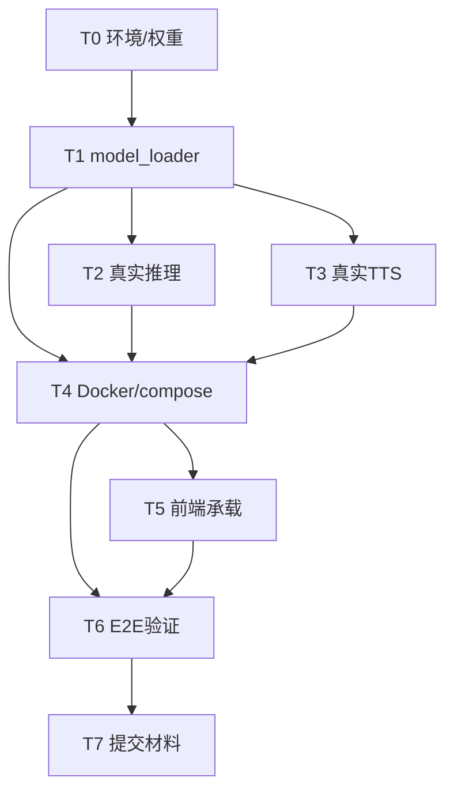

# AgentCorp 昇腾适配方案

> 统一异构算力环境适配 · 工程基础设计（以昇腾 NPU 为例）
> 模型：MiniCPM-o 4.5（全模态，约 9B，OpenCompass 综合 77.6）
> 版本：v0.3（落地对齐版）
> 适用范围：统一异构算力环境复现验证 + 单容器「可运行 Web Demo」交付
>
> **v0.3 修订（相对 v0.2）**：方案从纸面进入代码。已落地：`model_loader.resolve_device()`（NPU > CUDA > CPU 自动探测）、`ASCEND_BACKEND`（flag_gems / torch_npu 双后端）、GGUF/llama.cpp 端侧路径、compose 设备透传段。本次新增：`Dockerfile.ascend`（多阶段：Web 构建 + CANN 底座 + FlagOS 运行时层）、`docker-compose.ascend.yml`、serve.py 的 `WEB_ROOT` 前端静态托管（SPA fallback）、`/api/evaluate/run` 路径别名、`scripts/e2e_ascend.sh` 端到端验证。同时对齐安全收口后的默认值：`API_HOST` 默认回环、CORS 白名单制（容器内由环境变量显式放开）。
>
> **v0.2 修订（相对 v0.1）**：基于已申请的 HiDevLab 环境（CANN 9.1.0-beta.1 devel，Ubuntu 22.04 / Python 3.12）修订基础镜像与运行时叠加策略；新增 Python 3.12 兼容性风险核查（§3.2–3.3）；同步更新 §6 Dockerfile、§7 runbook、§8 任务拆分与 §9 风险/待办。

---

## 1. 目标与范围

**目标**：让 AgentCorp 的「全模态 HR 总监」评委模型 MiniCPM-o 4.5 在统一昇腾环境中跑通真实多模态推理，并以**单容器可运行 Web Demo** 形态对外交付。

**范围边界（明确不做什么）**：

| 项 | 纳入范围 | 排除范围 |
|----|---------|---------|
| 真实推理 | ✅ model-service 接入 MiniCPM-o 真实推理（视频/语音/图像/代码/文本） | ✗ 模型本身训练/微调 |
| Demo 形态 | ✅ 统一环境下可访问的 Web Demo（浏览器打开即用） | ✗ Electron 桌面 App 作为正式交付形态 |
| 前端 | ✅ 复用现有 React 评估页（六维雷达/语音讲解/证据留痕） | ✗ 重写前端 UI |
| 后端 | ✅ model-service（FastAPI + SSE）承载真实推理 | ✗ 新增独立网关/微服务 |
| 提交材料 | ✅ Web Demo + 开源仓库 + PPT + 项目说明 + 演示视频 | ✗ 商业部署/高并发生产化 |

**交付判定（可映射到通用评估维度）**：应用完整度、交互体验、模型能力展示（四模态交叉验证）、场景价值（HR 筛选）、工程质量、演示质量、复现可行性。

---

## 2. 技术选型决策

### 2.1 三条路径对比

| 路径 | 机制 | 对现有代码改动 | 风险 | 官方支持度 |
|------|------|--------------|------|-----------|
| **(a) FlagOS 开箱即用镜像** | `import torch; import flag_gems` 后底层自动切换 Ascend 后端，无需手写算子 | **最小**：与现有 `transformers` 代码基本同构 | 低；依赖官方镜像可用性 | ★★★ 官方「发布即 6 芯适配」 |
| **(b) torch_npu 自适配** | 手动 `cuda→npu`、`torch.cuda.*→torch.npu.*`，按需替换算子 | 中：`model_loader` 改 device + 少量算子 | 中；需对齐 CANN/驱动版本 | ★★★ 官方主推路径 |
| **(c) MindSpore** | 用 MindSpore 加载权重，需重写推理栈 | **最大**：`evaluator.infer` / `model_loader` 全面重写 | 高；现有 `transformers` 代码几乎不可用 | ★★ 需自行迁移 |

### 2.2 推荐结论

> **主路径 = (a) FlagOS 开箱即用镜像；兜底路径 = (b) torch_npu 自适配。不采用 (c) MindSpore。**

理由：
1. 现有 `model_loader.load_minicpmo()` 注释里已是 `transformers.AutoModel.from_pretrained(...).to("npu")` 写法，与 FlagOS/torch_npu 路径同构，**无需重写推理栈**。
2. FlagOS 的 `import flag_gems` 自动生效后端，省去算子替换；若官方镜像不可用或遇到兼容坑，降级到 (b) 仅需改 import 段与 `torch.npu` 内存管理，改动集中。
3. MindSpore 会迫使 `evaluator.infer` 与 `model_loader` 全面重写，且 `tests/test_evaluate_run.py` 的契约回归需重做，风险/收益比最差。

### 2.3 对现有代码的最小改动点（尤其 `model_loader.py`）

现有 `model_loader.py` 已具备优雅降级骨架（`available=False` 占位、`get_model()` 单例、`to_npu()` 透传）。**真实化只需「解注释 + 用 `settings.device` + 加后端 import」三处**：

```python
# model-service/app/model_loader.py —— 改造后核心片段
def load_minicpmo(model_path: str) -> MiniCPMModel:
    try:
        import os, torch
        backend = os.getenv("ASCEND_BACKEND", "torch_npu")  # flag_gems | torch_npu
        if backend == "flag_gems":
            import flag_gems          # FlagOS：import 即生效 Ascend 后端
        else:
            import torch_npu         # 注册 npu 设备
        from transformers import AutoModel, AutoProcessor
        model = AutoModel.from_pretrained(
            model_path, trust_remote_code=True, attn_implementation="sdpa"
        ).to(settings.device)        # ★ 用 settings.device（默认 npu），不再硬编码
        processor = AutoProcessor.from_pretrained(model_path, trust_remote_code=True)
        # NPU 内存管理（按需）：torch.npu.empty_cache()
        return MiniCPMModel(model=model, processor=processor)
    except Exception as exc:          # 无 NPU / 缺依赖 → 优雅降级，与现有行为一致
        logger.error("模型加载失败：%s", exc)
        return MiniCPMModel(available=False)
```

`config.py` 已就绪：`MODEL_PATH=/models/MiniCPM-o-4.5`、`DEVICE=npu`、`TEMPERATURE=0.0`、`SEED=42`、`FRAME_SAMPLE=8` —— **复现控制已内建**，无需新增。

---

## 3. 统一环境对接

### 3.1 HiDevLab 在线开发环境申请

| 步骤 | 操作 | 备注 |
|------|------|------|
| 1 | 注册登录 HiDevLab 平台 | 华为开发者账号 |
| 2 | 进入「体验 IDE」 | 在线开发/调试 |
| 3 | 创建环境 | 选择 Ascend 算力规格（建议 910B/910A，权重需 910B/910A，见 §4.1） |
| 4 | 申请权限 | 审核 1–3 工作日 |
| 5 | 拉取统一环境 | ✅ **已申请到**：基础镜像 `CANN` 9.1.0-beta.1（devel），见 §3.2 |

> **已确认环境规格（HiDevLab 分配）**：镜像 `quay.io/ascend/cann:9.1.0-beta.1`（devel 版），包含 CANN Toolkit、Python 3.12 与 Ascend C 算子开发基础依赖；OS 为 Ubuntu 22.04；包管理 apt。该镜像提供「驱动 / 算子编译底座」，**不含 AI 推理运行时（torch / torch_npu / flag_gems / transformers）**，运行时需在其上叠加（见 §3.2–3.3）。

### 3.2 统一基础镜像：CANN 9.1.0-beta.1（devel）

**已确认**：HiDevLab 分配的基础镜像为 `quay.io/ascend/cann:9.1.0-beta.1`（devel 版）。它提供 **OS（Ubuntu 22.04）+ CANN Toolkit 9.1.0 + Python 3.12 + Ascend C 算子开发基础依赖 + apt**，即「驱动 / 算子编译底座」。**该镜像不含 AI 推理运行时**（torch / torch_npu / flag_gems / transformers），需在其上叠加运行时（§3.3）。

#### 3.2.1 运行时叠加：明确推荐

> **推荐：以 FlagOS「开箱即用多芯版」镜像承载推理运行时，叠加在 CANN 9.1.0 devel 之上；不推荐在 CANN devel 的 Python 3.12 上直接手装 torch_npu。**

两种叠加方式对比：

| 方式 | 做法 | Python 版本 | 风险 | 推荐度 |
|------|------|------------|------|--------|
| **(A) FlagOS 镜像作运行时层** | `FROM quay.io/ascend/cann:9.1.0-beta.1` 作底层，上层叠加 FlagOS 提供的 torch + torch_npu + flag_gems（多阶段 `COPY --from` 或官方 FlagOS 镜像直接作基础，其底层 CANN 同样为匹配版本） | FlagOS 镜像自带 **3.10/3.11**（与 wheel 匹配） | 低 | ★★★ 主推 |
| **(B) 手装 torch_npu** | 在 CANN devel（Python 3.12）上直接 `pip install torch torch_npu`，版本对齐 CANN 9.1.0 | 系统 **3.12** → 易撞 wheel 错配（见 §3.3） | 高（3.12 wheel 风险） | ★ 兜底 |

**理由**：
1. **版本自洽**：FlagOS「开箱即用多芯版」镜像把 `torch + torch_npu + flag_gems + CANN` 按同一组合预编译并验证，`import flag_gems` 即切换 Ascend 后端，与现有 `transformers` 代码同构（§2.3），改动最小。
2. **避开 Python 3.12 错配**：CANN devel 是 Python 3.12，而 Ascend ML wheel 多数仍 targeting 3.10/3.11（§3.3）。FlagOS 镜像内部自带匹配的 3.10/3.11 运行时，业务代码无需关心 3.12。
3. **运维最少**：竞赛场景下省去 `pip` 版本对齐与编译，镜像一次性锁定，复现最稳。

> 若 HiDevLab 强制要求以 CANN 9.1.0 devel 为**唯一**基础且不允许另起 FlagOS 镜像，则走 §3.3 的「3.12 → 3.10/3.11 venv」降级方案，仍优先 `flag_gems` 后端。

### 3.3 Python 3.12 兼容性风险核查（torch_npu / MindSpore / FlagOS）

**核心结论**：CANN 9.1.0-beta.1 devel 自带的 Python 3.12 **不适合直接承载 Ascend ML 运行时**；应改用 FlagOS 镜像内置的 3.10/3.11，或在 devel 镜像内新建 3.10/3.11 虚拟环境。

| 组件 | Python 3.12 可用性（CANN 9.1.0-beta.1） | 版本匹配要求 | 风险 |
|------|----------------------------------------|-------------|------|
| **torch_npu** | 官方 wheel 历史主要面向 **3.10 / 3.11**；3.12 wheel 仅在较新 torch_npu + CANN 9.x 组合才补，且滞后 | 须与 **torch 版本 + CANN 9.1.0** 严格三角匹配 | **高**（系统 3.12 下 `pip` 易解析不到匹配 wheel，须源码编译或失败） |
| **MindSpore** | 2.x wheel 面向 3.9/3.10/3.11；3.12 支持部分（2.4+）且滞后 | 须与 CANN 9.1.0 匹配；另需全面重写推理栈（§2.1c） | **高**（不采用） |
| **FlagOS（flag_gems）** | 镜像**自带匹配 Python（3.10/3.11）+ torch_npu + flag_gems + CANN**，对业务代码不暴露 3.12 | 镜像内已自洽锁定 | **低**（★ 推荐） |
| transformers / opencv / decord / librosa / soundfile | 多为纯 Python 或 manylinux wheel，3.12 基本可用 | 与 Python 版本松耦合 | 低–中（decord/opencv 偶有 3.12 构建滞后，可换替代或降 venv） |

**为何 FlagOS 更稳妥（论证）**：
- FlagOS 镜像是「torch + torch_npu + flag_gems + CANN」**同一次发布、同一工具链编译**的产物，版本三角（torch ↔ torch_npu ↔ CANN 9.1.0）已官方验证；手装则需用户自行对齐该三角，且在 3.12 系统镜像上缺失匹配 wheel。
- 业务代码（§2.3 `model_loader`）只用 `import flag_gems` / `torch.npu`，不感知宿主 Python 版本，运行时层切换为零代码改动。

**若必须手装 torch_npu（降级 / 兜底）的 Python 版本处理**：
- 在 CANN 9.1.0 devel（系统 3.12）内**不要**用系统 Python 跑 ML 栈；新建隔离解释器：
  - `conda create -n npu python=3.11` 或 `python3.11 -m venv .venv`（先 `apt install python3.11 python3.11-venv` 或用 miniconda）；
  - 在该 3.11 环境内 `pip install torch==<X.Y> torch_npu==<匹配> torchvision`（版本对齐 CANN 9.1.0 官方兼容矩阵）；CANN Toolkit 的 C 侧（9.1.0）保持不变。
- **关键点**：宿主 Python 3.12 仅用于 Ascend C 算子开发 / 工具链；ML 推理运行时统一走 3.10/3.11 虚拟环境，规避 3.12 wheel 错配。

> 注：上述 3.12 wheel 可用性为基于 Ascend 生态现状的研判；CANN 9.1.0-beta.1 的 torch_npu / FlagOS 精确可用版本以官方发布说明与 starter kit 兼容矩阵为准（R9）。

### 3.4 NPU 设备透传

统一环境下容器需挂载 NPU 设备。`docker-compose.yml` **已预留注释段**，真实部署取消注释即可：

```yaml
# device 透传（真实部署启用）
devices:
  - /dev/davinci0:/dev/davinci0
  - /dev/davinci_manager:/dev/davinci_manager
  # 多卡/管理设备按需加：/dev/davinci1、/dev/devmm_svm、/dev/hisi_hdc
```

### 3.5 镜像与 starter kit 依赖

- 基础镜像已定为 `quay.io/ascend/cann:9.1.0-beta.1`（devel）；推理运行时层优先 FlagOS「开箱即用多芯版」（§3.2）。
- 模型权重、测试脚本、提交包规范**以官方 starter kit 为准**，权重拉取方式见 §4.1 与 §9.1（用户待办）。

### 3.6 官方公告前应对预案（starter kit 未发布）

| 不确定项 | 预案 |
|---------|------|
| 基础镜像 | ✅ 已确认为 CANN 9.1.0-beta.1 devel；运行时层优先 FlagOS，兜底 3.11 venv + torch_npu（§3.2–3.3） |
| torch_npu/FlagOS 版本未定 | `requirements.txt` 保持注释，版本在 starter kit 发布后一次性解锁；FlagOS 镜像优先则无需手写版本 |
| 设备号未定 | compose 设备段保持可配置；先用 `/dev/davinci0` 默认 |
| 权重获取方式未定 | 先按 Modelers.cn（Ascend 专用）为主、ModelScope 兜底两条路径准备（§4），以官方公告为准切换 |
| 提交包规范未定 | 代码结构保持「单容器 + /health 自检 + E2E 脚本」，天然适配多数提交规范 |

---

## 4. 模型权重与加载

### 4.1 权重获取路径（二选一，以官方公告为准）

| 来源 | 地址 | 说明 |
|------|------|------|
| Modelers.cn（昇腾专用） | `FlagRelease/MiniCPM-o-4.5-ascend-FlagOS` | Apache 2.0，bf16，需 Ascend 910B/910A |
| ModelScope / HuggingFace / 魔乐 | `OpenBMB/MiniCPM-o-4_5` | 官方通用权重，torch_npu/transformers 加载 |

> 推荐先用 **Modelers.cn 的 Ascend 专用权重**（已做昇腾适配，匹配 FlagOS 路径），通用权重作兜底。

### 4.2 显存预算（bf16）

| 项 | 估算 | 备注 |
|----|------|------|
| 权重 bf16（~9B） | ~18 GB（官方称 Ascend 版可在 **≥12GB** NPU 显存跑；具体以 starter kit 为准） | 实际占用随实现与分片策略变化 |
| 激活 + KV cache | +2~6 GB | 与序列长度/批大小相关 |
| 视觉/音频编码器峰值 | +1~3 GB | 多模态输入并发时 |
| **建议 NPU** | **Ascend 910B（64GB）** | 留足余量，避免 OOM 影响延迟/吞吐评分 |

### 4.3 `model_loader.py` 改造点（汇总）

1. **后端 import**：按 `ASCEND_BACKEND` 选择 `flag_gems` 或 `torch_npu`（§2.3）。
2. **device 选择**：统一用 `settings.device`（默认 `npu`），不用硬编码字符串。
3. **NPU 内存管理**：推理前后 `torch.npu.empty_cache()`；长视频/大图前做尺寸裁剪（复用 `settings.frame_sample`、`FRAME_SAMPLE`）。
4. **优雅降级不变**：缺 NPU/权重/依赖时 `available=False`，与 `serve.py` 的 503 逻辑衔接。

`config.py` 无需改动（路径/device/复现参数已齐）。

---

## 5. ★ 部署形态关键决策

### 5.1 问题

现有前端是 **Electron 桌面壳**（`package.json` 含 `electron` / `electron-builder` / `vite-plugin-electron`），在统一昇腾环境（Linux 容器/服务器，无 GUI/显示服务、未必有 pnpm/lockfile）**无法直接作为可运行 Demo 启动**。

### 5.2 决策：Demo 以「单容器 Web Demo」承载

**方案：model-service 容器内同时托管前端静态资源（FastAPI `StaticFiles`），浏览器访问同一端口（8000）即用。**

理由：
- 现有 `serve.py` 已是 HTTP/SSE 服务，前端与后端**彻底解耦**（契约见 `schemas.py` / `src/types/index.ts`），只需把静态资源挂到同一服务即可，无需新增 nginx。
- 统一环境复现最简单：**一个镜像、一个端口、一条 `docker compose up`**。
- `vite build`（已有 `build:vite` 脚本）产出纯 Web SPA 到 `dist/`，与 Electron 主进程产物（`dist-electron/`）解耦 —— **Web 构建不依赖 Electron 运行时**。

### 5.3 前端承载方案（推荐实现）

```text
浏览器 ──HTTP/SSE :8000──▶ AgentCorp model-service 容器
                            ├─ /            → StaticFiles(/app/web)  前端 SPA
                            ├─ /api/*       → FastAPI 真实/模拟推理
                            └─ /health      → 模型可用性自检
                            └─ (NPU)        → /dev/davinci0
```

**落地要点（v0.3 已实现）**：
- ✅ `model-service` 增加 `WEB_ROOT=/app/web` 环境变量；仅当该目录存在才挂载（`os.path.isdir`），纯 Mock 容器不报错。
- ✅ SPA history fallback：`SPAStaticFiles`（StaticFiles 子类，404 回退 `index.html`）。
- ✅ 同源零配置：前端在纯 Web 模式把 API base 解析为 `window.location.origin`（`src/lib/host-api.ts` 的 `resolveHostApiBase()`），SSE 流在无真实 Electron IPC 时直连同源——**容器里 evaluate 能打到真实模型**，而非回退离线 Mock。
- ✅ 路径拼写对齐：model-service 增加 `POST /api/evaluate/run` 别名（与 Host API 拼写一致），Web Demo 直连时前端零改动。
- **Electron 仍用于本地开发/桌面演示**，但正式提交以 Web Demo 为准；README 增加「Web Demo（统一环境）」与「Electron（本地）」双形态说明。

### 5.4 前端在统一环境下的取舍与待补

| 项 | 状态 | 动作 |
|----|------|------|
| Web SPA 构建 | ✅ `build:web`（vite.web.config.ts → `dist-web/`，含 demo.html 双入口） | `Dockerfile.ascend` 的 node:20 builder 阶段容器内构建，产物不提交仓库 |
| Electron 特有 import 泄漏到 renderer | ✅ 已解 | `vite-plugin-electron-renderer` 把 electron/node builtins 外置化；浏览器 shim 使 IPC 调用成为安全 no-op |
| 真实 wav 播放 | ⚠ 待真机核对 | Mock 用 `speechSynthesis`；真实模式 `audio` 事件携带 base64 wav，需 `AudioContext.decodeAudioData` 播放 —— 核对 `NarrationPanel` 已兼容 |
| 预构建提交 vs 容器内构建 | ✅ 容器内构建 | node:20 builder 阶段天然规避统一环境缺 pnpm 的风险；若 starter kit 强制预构建，`dist-web/` 改提交 `web/` 即可（构建步骤已是同一条命令） |

---

## 6. Dockerfile 增强清单

**v0.3 已落地为独立文件 `model-service/Dockerfile.ascend`**（通用 `Dockerfile` 保持 python:3.10-slim 不动，本地 Mock 演示不受影响）。基础镜像为 **CANN 9.1.0-beta.1 devel（底层）+ FlagOS 运行时层（上层）**，另增 node:20 Web 构建阶段；若 HiDevLab 不允许另起镜像，则走 CANN devel + 3.11 venv + torch_npu 兜底（见 §3.2–3.3，Dockerfile 内有对应注释段）。

| # | 增强项 | 实现 | 说明 |
|---|--------|------|------|
| 1 | 基础镜像 | `FROM quay.io/ascend/cann:9.1.0-beta.1` 作底层 + FlagOS 运行时层（多阶段 `COPY --from=runtime`）；或 CANN devel + 3.11 venv 兜底 | 业务解释器用 FlagOS 自带 / venv 的 **3.10/3.11**，避开系统 3.12（§3.3） |
| 2 | 推理依赖 | 运行时层若已含 torch / torch_npu / flag_gems 则 `requirements.txt` 仅业务侧；兜底路径解锁 `torch / torch_npu / transformers / opencv-python / decord / librosa / soundfile` | 版本随 CANN 锁定 |
| 3 | NPU 透传 | 运行时由 `docker-compose.yml` 挂载 `/dev/davinci*`（无需写进 Dockerfile） | 见 §3.4 |
| 4 | 权重挂载 | 运行时 `-v /path/weights:/models/MiniCPM-o-4.5` 或 compose `volumes` | `MODEL_PATH` 已指向该路径（§4.1） |
| 5 | 真实推理入口 | 默认 `MOCK=false`（统一环境）；本地演示保留 `MOCK=true` | `serve.py` 已按 `settings.mock` 分流 |
| 6 | 前端静态托管 | `COPY web /app/web`；`serve.py` 增加 `StaticFiles` 挂载（§5.3） | 预构建 `dist/` → `web/` |
| 7 | 复用已有 | `VOLUME /app/samples /app/uploads`、`EXPOSE 8000`、`CMD python3.11 -m app.serve` | 解释器用运行时层 3.11 |

**增强后 Dockerfile 骨架（多阶段，推荐）**：

```dockerfile
# 阶段 1：FlagOS 开箱即用多芯版镜像（自带 python 3.10/3.11 + torch + torch_npu + flag_gems + 匹配 CANN）
FROM <flagos-ascend-image> AS runtime
# 阶段 2：CANN 9.1.0 devel 作底层底座（OS + CANN Toolkit 9.1.0 + 驱动），整体拷入运行时层
FROM quay.io/ascend/cann:9.1.0-beta.1
ENV PYTHONUNBUFFERED=1 PYTHONDONTWRITEBYTECODE=1 PIP_NO_CACHE_DIR=1
WORKDIR /app
# 将 FlagOS 阶段匹配好的运行时（python + site-packages）整体拷入，规避系统 Python 3.12 wheel 错配
COPY --from=runtime /usr/local /usr/local
# 业务侧依赖（框架已由运行时层提供；走 venv 兜底时此处再 pip install 锁定版 torch_npu）
COPY requirements.txt .
RUN pip3.11 install --no-cache-dir -r requirements.txt
COPY app ./app
COPY tests ./tests
COPY web ./web                # ★ 预构建前端静态资源
VOLUME ["/app/samples", "/app/uploads", "/models"]
EXPOSE 8000
ENV MOCK=false \              # ★ 统一环境默认真实推理
    API_HOST=0.0.0.0 API_PORT=8000 \
    WEB_ROOT=/app/web \
    MODEL_PATH=/models/MiniCPM-o-4.5 \
    SAMPLES_DIR=/app/samples UPLOAD_DIR=/app/uploads
CMD ["python3.11", "-m", "app.serve"]   # ★ 用运行时层解释器（非系统 3.12）
```

> **备选（若 HiDevLab 禁止多阶段跨镜像）**：单阶段 `FROM quay.io/ascend/cann:9.1.0-beta.1` + `conda create -n npu python=3.11` 或 `python3.11 -m venv .venv`，在 3.11 环境内 `pip install torch==<X.Y> torch_npu==<匹配>`（对齐 CANN 9.1.0 兼容矩阵），`CMD` 用该 venv 解释器。

---

## 7. 端到端部署 runbook（命令序列）

```bash
# ① 克隆仓库
git clone <repo-url> agentcorp && cd agentcorp

# ② 已申请 HiDevLab 统一昇腾环境（CANN 9.1.0-beta.1 devel）；
#    需等待实际 NPU 算力分配（确认 910B/910A 规格与 /dev/davinciN 设备号）—— 见 §9.1

# ③ 构建镜像（基础 = CANN 9.1.0 devel + FlagOS 运行时层 + Web 构建阶段，见 §6）
docker build -t agentcorp-minicpmo:ascend -f model-service/Dockerfile.ascend .

# ④ 放置权重（Modelers.cn Ascend 专用版；需已确认 NPU 算力分配，见 §9.1）
mkdir -p /models/MiniCPM-o-4.5
# 从 Modelers.cn 拉取 Ascend 专用权重（Apache 2.0, bf16，需 910B/910A）：
#   FlagRelease/MiniCPM-o-4.5-ascend-FlagOS
# 通用权重兜底：OpenBMB/MiniCPM-o-4_5（ModelScope / HuggingFace / 魔乐）

# ⑤ 启动（透传 NPU，真实推理 + Web Demo 同端口托管）
cd model-service
MODEL_PATH=/models/MiniCPM-o-4.5 docker compose -f docker-compose.ascend.yml up -d

# ⑥ 前端访问（同一端口 8000）
#   浏览器打开 http://<npu-host>:8000  →  Web Demo（六维雷达/语音讲解/证据留痕）
#   端口默认只绑本机回环；评测机之外访问需把 compose 端口映射改为 "8000:8000"

# ⑦ 端到端验证（/health + 真实评估闭环 + 离线契约回归）
bash scripts/e2e_ascend.sh
# 或手动：
curl http://localhost:8000/health
# 期望：{"status":"ok","mock":false,"model_available":true}
curl -N -X POST http://localhost:8000/api/evaluate \
  -H 'Content-Type: application/json' \
  -d '{"candidate":{"id":"candidate-01","name":"琳达","declared_tags":["React"],"declared_budget":180,"persona_text":{"type":"text/markdown","content":"..."}},"preference":{"aesthetic":"minimal","budget_max":200,"preferred_stack":["React"],"weight":{"task":0.2,"quality":0.2,"comm":0.15,"creativity":0.15,"reliability":0.15,"cost":0.15}}}'
# 期望：SSE 流 radar_update×6 + narration/audio + verdict + done，且 model_available=true

# ⑧ 回归契约测试（离线，不依赖 NPU）
cd model-service && MOCK=true python -m pytest tests/ -q
```

---

## 8. 任务分解（有序、含依赖关系）

| ID | 任务 | 涉及文件 | 依赖 | 优先级 |
|----|------|---------|------|--------|
| T0 | 环境接入、NPU 算力分配与权重获取 | HiDevLab CANN 9.1.0 devel 环境、NPU 算力分配确认、/models 权重目录（Modelers.cn） | — | P0 |
| T1 | `model_loader.py` 真实加载（flag_gems/torch_npu + device + 运行时层 3.11 约定） | `app/model_loader.py`、`requirements.txt`、`Dockerfile`(运行时层) | T0（编码可并行） | P0 |
| T2 | `evaluator` 真实多模态推理（`load_media` + `infer` 接入 MiniCPM-o `chat`） | `app/evaluator.py`、`prompt_templates.py` | T1 | P0 |
| T3 | `tts.py` 真实语音（MiniCPM-o 原生 TTS / CosyVoice2 旁路） | `app/tts.py` | T1 | P1 |
| T4 | Dockerfile / compose 增强（CANN devel 基础镜像 + FlagOS 运行时层 / 3.11 venv 兜底、权重挂载、MOCK=false、前端静态托管） | ✅ v0.3 已落地：`Dockerfile.ascend`、`docker-compose.ascend.yml`、`serve.py`(WEB_ROOT) | T1–T3 | P0 |
| T5 | 前端承载改造（容器内构建 `dist-web/`、同源 API base、真实 wav 播放、Electron import 门控） | ✅ v0.3 已落地（wav 播放待真机核对）：`vite.web.config.ts`、`src/lib/host-api.ts` | T4（可并行） | P1 |
| T6 | E2E 验证脚本与 `/health` 真实闭环 + 复现检查（temperature/seed 一致） | ✅ v0.3 已落地：`scripts/e2e_ascend.sh`、`tests/test_web_root.py` | T1–T5 | P1 |
| T7 | 提交材料准备（开源仓库、Web Demo、PPT、项目说明、演示视频） | 仓库根、docs/ | T4–T6 | P1 |

**依赖图**：



> T0 环境申请可与 T1–T3 的代码编写**并行**（代码无需真 NPU 即可写，靠 MOCK 路径验证）。T0 中「NPU 算力分配确认」与「权重拉取」依赖官方 starter kit / HiDevLab 实际分配，是 T4–T7 真机验证的门控项（见 §9.1）。

---

## 9. 风险与待确认

| # | 风险 / 待确认 | 影响 | 缓解 / 决策 |
|---|--------------|------|------------|
| R1 | 官方 starter kit 未发布（镜像/版本/提交规范未定） | 阻塞精确版本锁定 | §3.5 预案；结构保持零改动可切换 |
| R2 | 显存达标风险（bf16 ≥12GB，含激活/KV） | 加载失败 / OOM | 优先 910B；预留 int4/GGUF 量化后路（R5） |
| R3 | 延迟/吞吐未达标（TTFT/E2E） | 评测维度扣分 | `FRAME_SAMPLE=8` 限帧、图像最长边≤1024、temperature=0 提速；后续可加 KV 缓存/批处理 |
| R4 | FlagOS 与现有 `transformers` 代码兼容性 | 推理报错 | 先 FlagOS；不兼容即降级 torch_npu（§2.2） |
| R5 | 是否需要量化（int4/GGUF） | 显存/延迟 | **默认 bf16**；仅当 R2 触发时引入 llama.cpp-omni / vLLM-plugin-FL 量化路径 |
| R6 | MOCK 与真实路径一致性 | 提交「演示质量/复现」不符 | `evaluator` 两路径共用 `parse_output` / `compute_user_fit`；E2E 脚本双跑对比 |
| R7 | 前端 Electron import 泄漏到 Web 构建 | 容器 Web Demo 白屏 | T5 用 `VITE_TARGET` 门控；`vite build` 后人工开 8000 冒烟 |
| R8 | 真实模式 `audio` 事件（base64 wav）前端未播放 | 语音讲解缺失 | T5 核对 `NarrationPanel` 支持 wav 解码播放 |
| R9 | CANN 9.1.0-beta.1 的 torch_npu / FlagOS 精确版本未锁定（beta 镜像） | 版本错配 / 构建失败 | 以官方发布说明与 starter kit 兼容矩阵为准；FlagOS 镜像优先可免手写版本 |
| R10 | Python 3.12 系统镜像与 Ascend ML wheel（3.10/3.11）错配 | `pip` 解析不到匹配 wheel / 源码编译失败 | 运行时层用 FlagOS 自带 3.10/3.11，或 CANN devel 内建 3.11 venv（§3.3） |
| R11 | 实际 NPU 算力分配未到位（910B/910A 规格与 /dev/davinciN 设备号） | 阻塞 T0 真机验证 / T4–T7 | 等 HiDevLab 实际分配；本地先用 MOCK 路径并行开发（§9.1） |

### 9.1 用户仍需完成的事项（HiDevLab / 权重 / Starter Kit）

以下事项依赖官方 / 平台侧，非工程代码可独立完成，需用户推进或拍板：

| # | 待办 | 说明 / 决策点 |
|---|------|--------------|
| D1 | **等待官方 starter kit** | 镜像 / 版本 / 提交包规范以官方公告与 starter kit 为准；当前方案已留零改动切换点 |
| D2 | **实际 NPU 算力分配** | 向 HiDevLab 确认 910B/910A 规格与 `/dev/davinciN` 设备号；决定权重路径与显存预算（§4.2） |
| D3 | **权重拉取** | 从 Modelers.cn 拉取 Ascend 专用版 `FlagRelease/MiniCPM-o-4.5-ascend-FlagOS`（Apache 2.0，bf16，**需 910B/910A**）；通用权重 `OpenBMB/MiniCPM-o-4_5` 作兜底 |
| D4 | **运行时叠加方式拍板** | 若 HiDevLab 允许另起 FlagOS 镜像 → 多阶段方案 A（§3.2.1）；若强制 CANN 9.1.0 devel 为唯一底座 → 走 3.11 venv + torch_npu 兜底（§3.2–3.3） |

---

## 10. 交付材料对齐清单

| 提交材料 | 状态 | 说明 / 待补 |
|---------|------|------------|
| 开源仓库 | 🟡 已具备骨架，待补适配 | 现有仓库结构完整；补齐 T1–T5 后即为可复现仓库 |
| 可运行 Demo / Web Demo | 🟡 形态已定（单容器 Web Demo），待实现 | T4+T5 完成后 `docker compose up` 即出 Web Demo |
| App | 🟡 Electron 本地版已存在 | 正式以 Web Demo 为准；Electron 保留作本地演示 |
| PPT | 🔴 待补 | 基于本方案 + 演示脚本（`docs/demo-script-A.md`）制作 |
| 项目说明 | 🟡 README 已含昇腾部署章节，待更新 | 补「Web Demo 形态」「复现步骤（§7）」「评分维度映射」 |
| 演示视频 | 🔴 待补 | T6 验证通过后录制真实评估闭环（§7 ⑥⑦） |
| 鼓励：交互设计说明 | 🟡 前端组件齐全，待整理 | 六维雷达/语音/证据留痕交互可成文 |
| 鼓励：应用案例文章 | 🔴 待补 | HR 筛选场景价值文章 |

**图例**：🟢 已具备 ｜ 🟡 部分具备/待补 ｜ 🔴 待补

---

> 本方案为 starter kit 发布前初步设计，所有版本号/权重路径/提交规范以官方公告与 starter kit 为准；结构预留零改动切换点（基础镜像 `FROM`、推理后端 `ASCEND_BACKEND`、compose 设备段），降低公告后返工。
